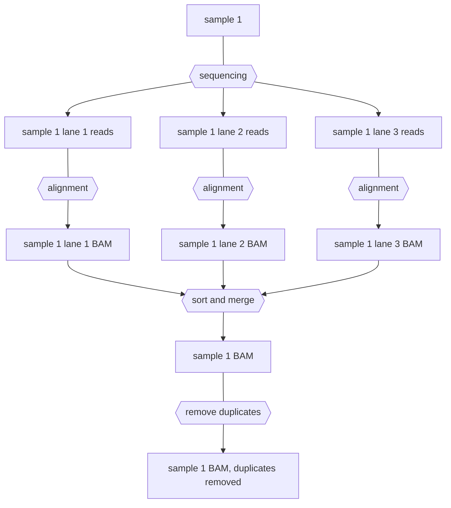
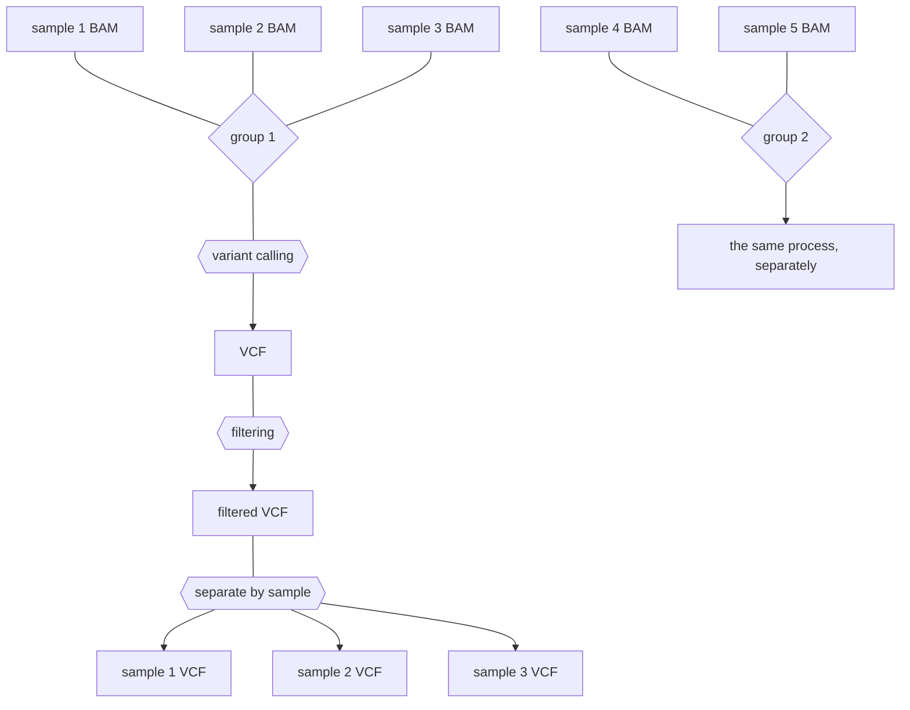
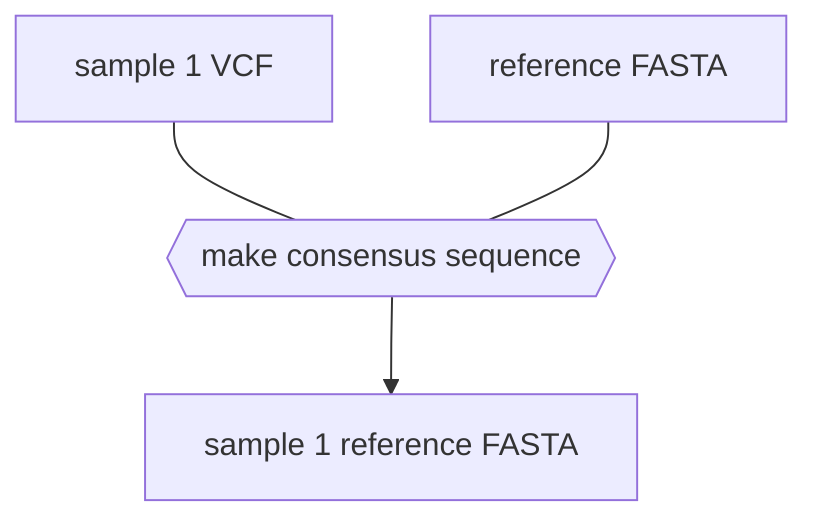

# DNA sequencing pipeline

This pipeline is designed to take reads from Illumina or Nanopore data and generate any of the following:
- Alignments
- Variant calls
- Consensus sequences from variant calls
- TSVs to easily import variant calls into R for analysis


> [!important] 
> When a line in a code block starts with a `$`, it means that that line should be entered into the terminal prompt. **Do not** include the `$` when typing/copying the command into the prompt.
> 
> I will also embed anything that should be filled in in `<these brackets>`. Don't include the brackets when you fill in your own information.
> 
> **I HIGHLY recommend learning some [basic terminal skills](https://www.freecodecamp.org/news/linux-command-line-tutorial/) before attempting this tutorial.** I will show step by step instructions for how to run the pipeline, but will not include a tutorial for basic terminal navigation skills. This is just one guide, but there are many guides out there you can use as a reference.

>[!note]
>This guide is designed for use with Unix systems (Mac, Linux). Windows users may need to use [Windows Subsystem for Linux (WSL)](https://learn.microsoft.com/en-us/windows/wsl/install) for some commands to work.
## Downloading data

## Uploading Novogene data

When your data is ready, you should get an email that looks like this. Click the link highlighted in yellow:

![[Pasted image 20231120164637.png]]

It should ask you for your email and password (you used these to make an account to put in the order).  

Go to the data release for your project and click Batch download. A panel will open up on the side with a [wget](https://www.gnu.org/software/wget/) command. In the terminal, connect to Longleaf and go to the directory in which you plan to store your data. Send the wget command as a job to [SLURM](https://help.rc.unc.edu/longleaf-slurm-examples/), Longleaf's job handling application. This will take a while.

```
# connect to Longleaf
$ ssh <onyen>@longleaf.unc.edu

# go to the directory where you want to store the data
$ cd /proj/sekellab/projects/<PROJECT-NAME>/

# submit the wget command as a job to SLURM
$ sbatch -p general -N 1 -n 1 --mem=5g -t 05-00:00:00 --wrap="<WGET-COMMAND-FROM-NOVOGENE>"
```


You should be in the directory with your Novogene data, and your directory should now look something like this (with sample being a placeholder for a sample name):

```
$ tree
.
└── usftp21.novogene.com/
    ├── 01.RawData/
    │   └── sample/
    │       ├── MD5.txt
    │       ├── sample_CKDN230029067-1A_HCTF3DSX7_L3_1.fq.gz
    │       ├── sample_CKDN230029067-1A_HCTF3DSX7_L3_2.fq.gz
    │       ├── sample_CKDN230029067-1A_HGKT2DSX7_L4_1.fq.gz
    │       └── sample_CKDN230029067-1A_HGKT2DSX7_L4_2.fq.gz
    ├── 02.Report_X202SC23082820-Z01-F001.zip
    ├── checkSize.xls
    ├── MD5.txt
    ├── MD5.zip
    └── Readme.html
```

>[!note]
The number of files and the suffix for each of the sample files (e.g. CKDN230029067-1A_HCTF3DSX7) will vary.

> [!tip]
> You can use the command `tree` to display a directory structure like the one above.

### Verifying that your download worked

You should check the checksum of all of your files to make sure the downloads were complete.
```
$ cd usftp21.novogene.com
$ md5sum -c MD5.txt
```

If it works, it will say something like:
```
01.RawData/sample/sample_CKDN230029067-1A_HCTF3DSX7_L3_1.fq.gz: OK
# ... and so on for every file in all of the sample directories
```

>[!note]
>If the md5sum check fails, your data is corrupted and you need to redownload it.

## Uploading Nanopore data

Because the file size to transfer is large, you will need to use [GLOBUS](https://help.rc.unc.edu/getting-started-with-globus-connect) to transfer the data from the Nanopore computer to Longleaf.

First, compress the data to make it easier to transfer. Because /var isn't a subdirectory of your home directory, you will need to perform this operation as the root user (or "super user", `sudo` = **S**uper **U**ser **Do**. This is like running a program with admin privileges, in Windows). Since you are performing this command as root, it will prompt you for the computer's password.

```
$ cd /var/lib/minknow/data/<PROJECT-NAME>/<FLOWCELL-ID>
$ sudo tar -czvf <PROJECT-NAME>.tar.gz fastq_pass/*
```

You should now have a file called `PROJECT-NAME.tar.gz` (where PROJECT-NAME is a placeholder for whatever you named your project in MinKNOW).

GLOBUS can't recognize any directories above your home directory, so let's move the compressed file somewhere else:
```
$ sudo mv <PROJECT-NAME>.tar.gz ~
```

Now `PROJECT-NAME.tar.gz` is in our home directory (`~`).

Start up Globus Connect Personal on the Nanopore computer:
```
$ ~/globusconnectpersonal & disown
```

A window should pop up. Click "Connect" and make sure not to close the window.

In a web browser, go to https://www.globus.org and click "Log in" at the top right. Use the organizational login, and search for University of North Carolina - Chapel Hill in the drop down. There will be a few screens to go through and then you'll be prompted for your ONYEN. See https://help.rc.unc.edu/getting-started-with-globus-connect for more detail and screenshots.

Once you're logged in, click the File Manager tab on the left side. You'll see a split screen view of two different data collections:

![[nanopore.png]]

In the left collection search box, type "nanopc" and click the result that pops up. This is the Nanopore computer. In the right box, search "UNC, Research Computing, DataMover" and click the result that pops up. This is Longleaf.

>[!note]
>If the icon for nanopc is red, indicating that the connection is offline, start Globus Connect Personal again by typing `~/globusconnectpersonal` in the terminal.

You will automatically be in the home directory for both collections. In the UNC DataMover collection, change the path to `/work/users/<o>/<n>/<onyen>/`.

Find and click your `<PROJECT-NAME>.tar.gz` file in the left collection (it should be highlighted in blue), then click the blue Start button on the left. A green popup should appear saying the transfer request has been submitted.
![[transfer.png]]

Now click the Activity panel on the left side menu. You should find an entry that says "nanopc to UNC, Research Computing, DataMover". Click it,and it will take you to a page showing the progress of your transfer.

When the condition says "SUCCEEDED" your file transfer has finished.

## Cloning the pipeline

Go to your work directory on Longleaf at `/work/users/o/n/onyen/` (where 'o' and 'n' are the first and second letters of your ONYEN, respectively).

```
$ cd /work/users/<o>/<n>/<onyen>/
```

Clone the pipeline from [here](https://github.com/caturcotte/seq_pipeline/tree/main) (click the green button that says Code, then copy the link in the drop down), then go to the directory of the repository.
```
$ git clone https://github.com/caturcotte/seq_pipeline.git
$ cd seq_pipeline/
```

The directory tree of the pipeline should look like this:
```
$ tree
.
├── config.yaml
├── miniforge_installer.sh
├── README.md
├── sample_sheet.csv
├── slurm
│   └── config.yaml
├── slurm_sub.sh
├── Snakefile
└── workflow
    ├── alignment.smk
    ├── calling.smk
    ├── envs
    │   ├── bcftools.yaml
    │   ├── bowtie2.yaml
    │   ├── bwa.yaml
    │   ├── concat_vcfs.yaml
    │   ├── environment.yaml
    │   ├── freebayes.yaml
    │   ├── minimap2.yaml
    │   ├── repeatmasker.yaml
    │   └── samtools.yaml
    ├── functions.smk
    ├── misc.smk
    ├── qc.smk
    └── vcf_filtering.smk
```

We are now ready to clone the pipeline.

## Cloning the pipeline

If you haven't already, go to the terminal and connect to Longleaf via SSH:

```
$ ssh <onyen>@longleaf.unc.edu
```

Go to your work directory on Longleaf at `/work/users/o/n/onyen/` (where 'o' and 'n' are the first and second letters of your ONYEN, respectively).

```
$ cd /work/users/<o>/<n>/<onyen>/
```

Clone the pipeline from [here](https://github.com/caturcotte/seq_pipeline/tree/main) (click the green button that says Code, then copy the link in the drop down), then go to the directory of the repository.

```
$ git clone https://github.com/caturcotte/seq_pipeline.git
$ cd seq_pipeline/
```

The directory tree of the pipeline should look like this:

```
$ tree
.
├── config.yaml
├── miniforge_installer.sh
├── README.md
├── sample_sheet.csv
├── slurm
│   └── config.yaml
├── slurm_sub.sh
├── Snakefile
└── workflow
    ├── alignment.smk
    ├── calling.smk
    ├── envs
    │   ├── bcftools.yaml
    │   ├── bowtie2.yaml
    │   ├── bwa.yaml
    │   ├── concat_vcfs.yaml
    │   ├── environment.yaml
    │   ├── freebayes.yaml
    │   ├── minimap2.yaml
    │   ├── repeatmasker.yaml
    │   └── samtools.yaml
    ├── functions.smk
    ├── misc.smk
    ├── qc.smk
    └── vcf_filtering.smk
```

Now that the pipeline has been copied to Longleaf, we can configure it.

## Configuring the pipeline

### Editing `config.yaml`

>[!note]
There are two files called `config.yaml` - one in `seq_pipeline/` and one in `seq_pipeline/slurm/`. Here I am referring to the one in `seq_pipeline/`.

Open config.yaml in a text editor:
```
$ nano config.yaml
```

You will see that there are numerous options for configuring the pipeline for your needs. There are comments in the file explaining the purpose of all of the options. Some of the more notable ones:
- **`ref_name` and `ref_file`:** The name and location of the reference genome FASTA, respectively. The default is the dm6 release from UCSC, which is already stored on Longleaf. The pipeline will [symlink](https://en.wikipedia.org/wiki/Symbolic_link) (make a shortcut) to your ref_file at `data/resources/ref_name.fa`. Note that the original files are not altered in the pipeline, so there isn't a need to make a copy.
- **`data_locations`:** These are shorthands for specific locations where your data is located. See the [[Running the DNA sequencing analysis pipeline#Pointing the pipeline to your read files|Pointing the pipeline to your read files]] section for more detail.

### Adding your samples into sample_sheet.csv

In a new terminal, move to a **directory you can easily access via your file browser**. In this directory, open up an [[SFTP]] connection to [[Longleaf]] and copy `sample_sheet.csv` to your local computer.
```
$ cd ~/Downloads
$ sftp <onyen>@longleaf.unc.edu
$ cd /work/users/<o>/<n>/<onyen>/seq_pipeline/
$ get sample_sheet.csv
```

In this case, the file was downloaded to the Downloads folder.

>[!tip]
>If you open your SFTP connection in the wrong location, you can use `lls` (local list directory) and `lcd` (local change directory) to navigate to a better location without exiting the connection.

Edit sample_sheet.csv in Excel. Each of your samples will have its own row in the sheet. 

>[!note]
The adapter fields (Novogene and Nanopore) and barcode field (for Novogene only) can be left blank. If left blank, adapters/barcodes will not be trimmed for that sample. Often reads come demultiplexed, meaning reads containing adapter/barcodes have already been trimmed because the barcode sequences were used to sort the files into the folders for their respective samples.

**For Novogene samples** the sample names must match the original names you gave the samples when you sent them to Novogene. 

>[!tip]
>You can check your sample names with `ls /path/to/reads/usftp21.novogene.com/01.RawData/` - all of the subdirectories in this directory will correspond to the names you gave your samples originally. 

**For Nanopore samples** the sample name can be whatever you want so long as it does not include spaces, but the barcode column should contain the number of the barcode used for that sample.

Save `sample_sheet.csv` as a csv file under the same name and directory as before (rewrite the original file). Then re-upload the file to Longleaf:

```
$ put sample_sheet.csv
```

You can now exit the SFTP connection (type `exit`) and go back to your original SSH connection (if you saved the other terminal window, otherwise connect to Longleaf and change directory to the `seq_pipeline` folder again).

### Pointing the pipeline to your read files

>[!note]
Multiple locations can be specified in data_locations. Each location should be on a new line in the file.

The way to point the pipeline to your files differs slightly between Novogene and Nanopore data.

Here I show examples for both. In both cases we will assume the `data_locations` entry in `config.yaml` looks like this, with an entry called `example_location`:

```
data_locations:
	example_location: /absolute/path/to/files/
```
#### For Novogene

If, in `sample_sheet.csv`, the location of sample A is set to `example_location`:

| sample | group  | platform | source   | read_type | location         |
|--------|--------|----------|----------|-----------|------------------|
| A      | group1 | illumina | novogene | paired    | example_location |

The pipeline will look for these files for A:
`/absolute/path/to/files/usftp21.novogene.com/01.RawData/A/A*_1.fq.gz` (read 1) and `/absolute/path/to/files/usftp21.novogene.com/01.RawData/A/A*_2.fq.gz` (read 2).

>[!note]
`*` is a [wildcard](https://en.wikipedia.org/wiki/Wildcard_character) meaning "one or more occurances of any character." For example, `A*_1.fq.gz` will match all read 1 files for sample A.

#### For Nanopore
If, in `sample_sheet.csv`, the location of sample A is set to `example_location`:

| sample | group  | platform | source   | read_type | location         | barcode |
|--------|--------|----------|----------|-----------|------------------|---------|
| A      | group1 | nanopore | nanopore | single    | example_location | 1       |

The pipeline will look for the files for A in `/absolute/path/to/files/fastq_pass/barcode01/*.fq.gz`.

### Modifying slurm submission scripts with your email

Open slurm_sub.sh:
```
$ nano slurm_sub.sh
```

Edit the mail-user line, replacing `YOUR-EMAIL-HERE` with your UNC email.
Save and exit the file with `Ctrl+O` and `Ctrl+X`.

Do the same for `slurm/config.yaml`.

## Running the pipeline

We're ready to run the pipeline! Make sure you're in `seq_pipeline`, then use the following command to run the pipeline:

```
$ sbatch slurm_sub.sh
```

The output should say `Submitted batch job JOB-NUMBER.`

The pipeline is now running. While it's running, you can monitor the status of your jobs.

## Monitor the status of all of your jobs

You can do the following to monitor the status of your jobs:
```
$ squeue -u <onyen>
             JOBID PARTITION     NAME     USER ST       TIME  NODES NODELIST(REASON)
```

The pipeline will submit jobs to SLURM automatically through your account, so you will likely see several jobs here. ST indicates the status of the job, where PD means pending and R means that the job is currently running. TIME indicates the time that the job has been running for.

If you want to continually monitor the status of your jobs:
```
$ squeue -u <onyen> -i 60
```

This will update with the status of your jobs every minute (press Ctrl+C to cancel).

### Monitor the output log

To continually follow the output of your jobs, use:
```
$ tail -F slurm-<JOB-NUMBER>.out
```

This will continually report the status of all of the jobs (press Ctrl+C to cancel).

If you see an error, such as:
```
[Mon Nov 27 10:41:49 2023]
Error in rule sort_bams:
    jobid: 15
    input: data/alignments/ndj_01_CKDN230029052-1A_HGL2TDSX7_L1.bam
    output: data/alignments/ndj_01_CKDN230029052-1A_HGL2TDSX7_L1_sort.bam
    shell:
        samtools sort data/alignments/ndj_01_CKDN230029052-1A_HGL2TDSX7_L1.bam -l 1 -o data/alignments/ndj_01_CKDN230029052-1A_HGL2TDSX7_L1_sort.bam --threads 4
        (one of the commands exited with non-zero exit code; note that snakemake uses bash strict mode!)
    cluster_jobid: Submitted batch job 23700119

Error executing rule sort_bams on cluster (jobid: 15, external: Submitted batch job 23700119, jobscript: /work/users/c/a/cannecar/seq_pipeline/.snakemake/tmp.x1vvuyv2/snakejob.sort_bams.15.sh). For error details see the cluster log and the log files of the involved rule(s).
```

Then there was a problem with a job. You can view the output of one of the jobs that failed to see more specific details (see below).
### View the output of specific jobs

>[!tip]
>If one of the jobs gave you an error. you can use the error message from the main output log to quickly find the corresponding log file.
>
Let's say the error message from the main output logis "Error executing rule format_bcf on cluster (jobid: 26, external: Submitted batch job **23966205**".
>
In seq_pipeline/ you can find the corresponding log file with `find logs/ -name '23966205'` (which will print the name of the file to the terminal output).

In the logs/ folder, there will be folders for each job that has been run. For example:
```
$ cd /work/users/c/a/cannecar/seq_pipeline/logs/
$ ls
align_bwa		bwa_idx	    fix_mate_pairs   mask_repeats  separate_into_samples
bcftools_call		bwa_mem	    format_bcf       merge_bams    sort_bams
bcftools_index		faidx_ref	    freebayes	     merge_tsvs    vcf_stats
bcftools_mpileup_single  fastqc_paired	    index_bams       mosdepth
bcftools_norm		filter_low_quality  mark_duplicates  multiqc
```

If we go into one of these folders, there will be a file for each sample. named in the form SLURM-JOB-ID-JOB-NAME-sample=SAMPLE.out:
```
$ cd merge_bams
$ ls
'merge_bams-sample=ndj_01.out'	'merge_bams-sample=ndj_07.out'	'merge_bams-sample=ndj_13.out'
'merge_bams-sample=ndj_02.out'	'merge_bams-sample=ndj_08.out'	'merge_bams-sample=ndj_14.out'
'merge_bams-sample=ndj_03.out'	'merge_bams-sample=ndj_09.out'	'merge_bams-sample=ndj_15.out'
'merge_bams-sample=ndj_04.out'	'merge_bams-sample=ndj_10.out'	'merge_bams-sample=ndj_16.out'
'merge_bams-sample=ndj_05.out'	'merge_bams-sample=ndj_11.out'
'merge_bams-sample=ndj_06.out'	'merge_bams-sample=ndj_12.out'
```


You can view the output of one of these files using `cat FILE-NAME` (which prints the contents to stdout, the terminal output) or `less FILE-NAME` (which opens the contents in a separate window - press `q` to return to the terminal prompt. If you're wondering why it's called  less, it's because `less` is the improved successor of a more suitably named program called `more`, which does the same thing... so "less is more").

If the job completed successfully, the end of the file will probably say something like
```
[Tue Nov 28 11:26:26 2023]
Finished job 0.
1 of 1 steps (100%) done
```

If not, the job is either still running or there will be some error you can see in the log file.

## Viewing your output files

All of the output files should be in the `data/` directory:

| output type | location         | recommended tool to view |
| ----------- | ---------------- | ------------------------ |
| alignments  | data/alignments/ | IGV                      |
| calls       | data/calls/      | text editor/less/bcftools              |
| consensus   | data/consensus/  | Snapgene alignment/IGV                         |
| tsvs            |  data/tsvs                | R                         |

You can use IGV on Longleaf directly so long as you use the `-X` flag when establishing your SSH connection:

```
ssh -X <onyen>@longleaf.unc.edu
```

>[!note]
>To use the `-X` flag on Mac you'll need to download [XQuartz](https://www.xquartz.org/).


## Checking the quality of your samples

The pipeline will automatically run several QC metrics for your samples and compile them into one report. To view the report, it's easiest to download the html content first to your home computer.

Exit your SSH connection and connect to Longleaf via SFTP. Then, navigate to the `data/qc` folder within `seq_pipeline` and download the multiqc files:
```
$ sftp <onyen>@longleaf.unc.edu
$ cd /work/users/<o>/<n>/<onyen>/seq_pipeline/data/qc/
$ get -r multiqc*

# files will download...

$ exit
```

Now, open `multiqc.html` in Firefox:
```
$ firefox multiqc.html
```

There are various metrics in this report that you can look at. A good one to start with is the FASTQC report, which tells you the quality of your reads. You can also see the average read depth for each of your samples, and transition to transversion ratio to determine the quality of the calls. For *Drosophila* WGS, the Ts/Tv ratio should be around 2 [1]. Too low indicates a high false positive rate of calling, and too high indicates a biased callset (see [this post](**https://bioinformatics.stackexchange.com/questions/4362/why-ti-tv-ratio**))

See [here](https://gatk.broadinstitute.org/hc/en-us/articles/360035531572-Evaluating-the-quality-of-a-germline-short-variant-callset) for more information on variant calling metrics.


## How the pipeline works

### Alignment and [BAM](https://en.wikipedia.org/wiki/Binary_Alignment_Map) processing

First, all of the reads or read pairs for a given sample will be individually aligned to whatever reference genome is selected in `config.yaml`. The alignments will then be sorted and merged into a single BAM file, with lane information being preserved in the [read group](https://gatk.broadinstitute.org/hc/en-us/articles/360035890671-Read-groups) tags of the reads. Next, the BAM files will be processed to remove [duplicates](https://chaochungkuo.github.io/notes/optical-nonoptical-duplicates/). This is only necessary for Illumina sequencing and sequencing of PCR-amplified DNA, but it will not be detrimental for analysis of Nanopore reads.


### Group variant calling

Next, the polished BAM files (with duplicates removed) will be pooled into the groups specified in the sample sheet. Variants will be called and sorted into variant call format files.


Using these VCFs, you can make consensus sequences for your samples by applying the variants in the sample to the reference genome. The resulting FASTA files can be viewed in Snapgene, etc. for downstream analysis.



[1] Keightley PD, Trivedi U, Thomson M, Oliver F, Kumar S, Blaxter ML. Analysis of the genome sequences of three Drosophila melanogaster spontaneous mutation accumulation lines. Genome Res. 2009 Jul;19(7):1195-201. doi: 10.1101/gr.091231.109. Epub 2009 May 13. PMID: 19439516; PMCID: PMC2704435.
