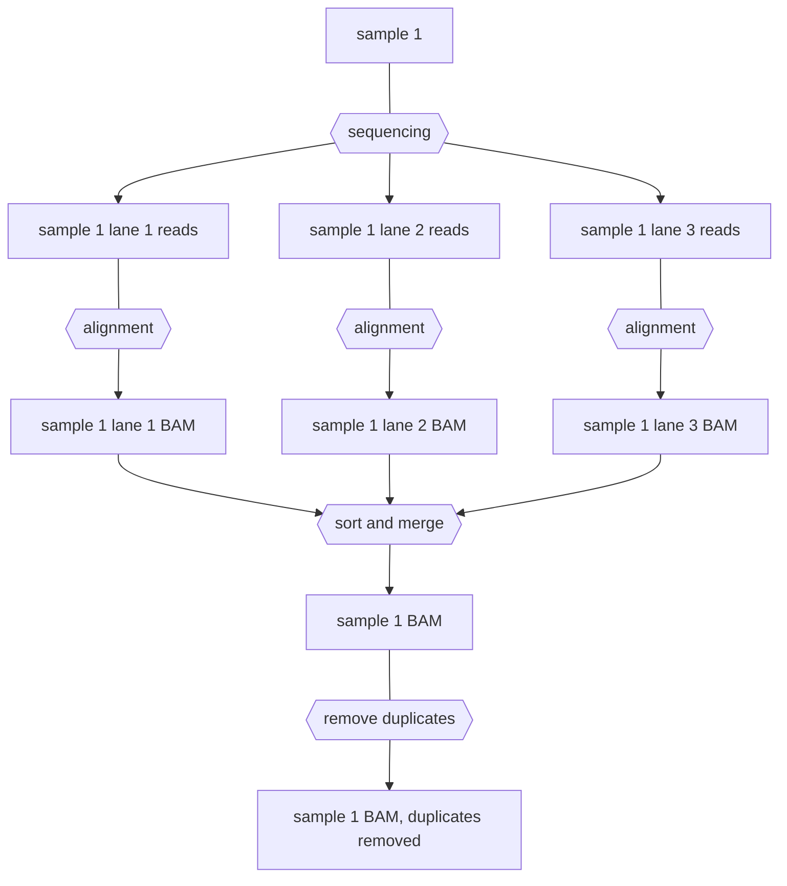
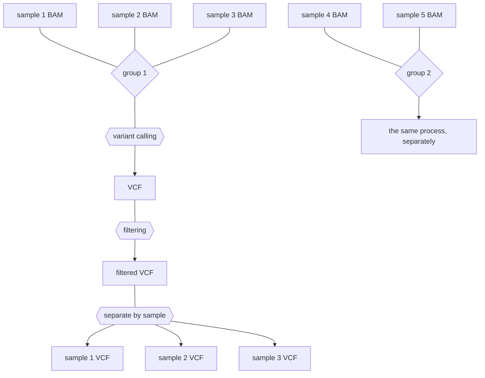
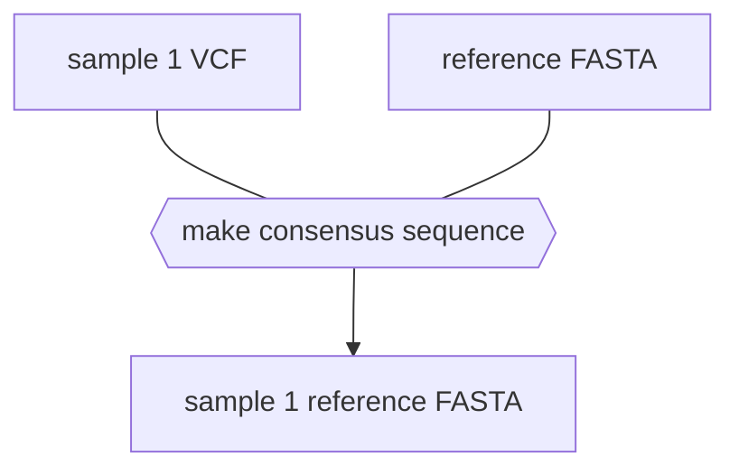

## How the pipeline works

#### Alignment and [BAM](https://en.wikipedia.org/wiki/Binary_Alignment_Map) processing

First, all of the reads or read pairs for a given sample will be individually aligned to whatever reference genome is selected in `config.yaml`. The alignments will then be sorted and merged into a single BAM file, with lane information being preserved in the [read group](https://gatk.broadinstitute.org/hc/en-us/articles/360035890671-Read-groups) tags of the reads. Next, the BAM files will be processed to remove [duplicates](https://chaochungkuo.github.io/notes/optical-nonoptical-duplicates/). This is only necessary for Illumina sequencing and sequencing of PCR-amplified DNA, but it will not be detrimental for analysis of Nanopore reads.

#### Group variant calling

Next, the polished BAM files (with duplicates removed) will be pooled into the groups specified in the sample sheet. Variants will be called and sorted into [[Variant Call Format]] files.

Using these VCFs, you can make consensus sequences for your samples by applying the variants in the sample to the reference genome. The resulting FASTA files can be viewed in Snapgene, etc. for downstream analysis.

